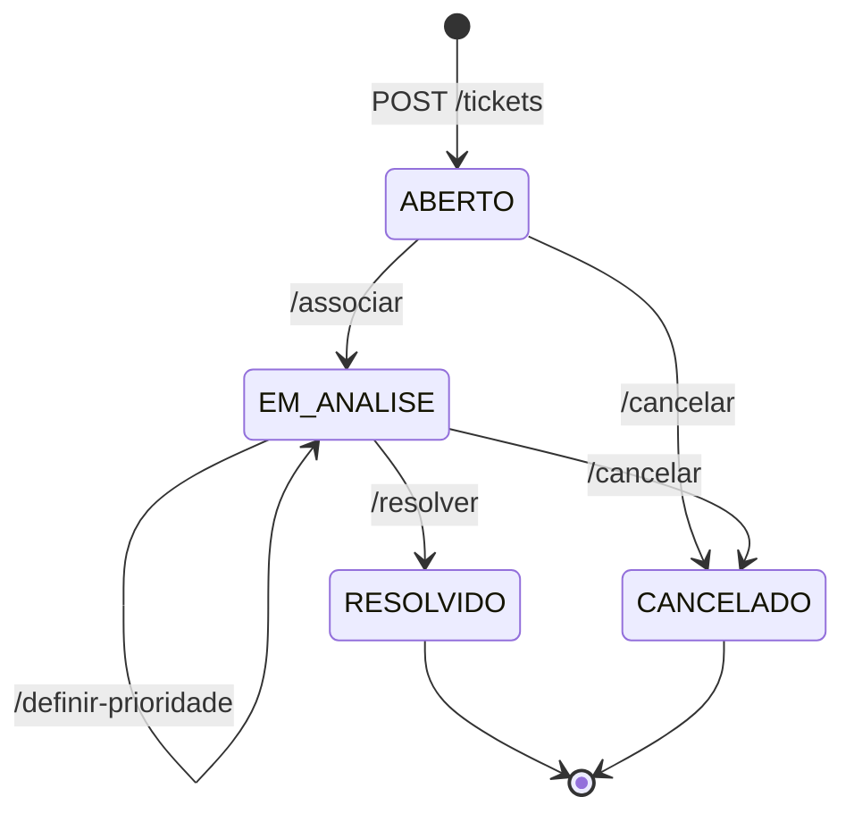

# Planejamento — Funcionalidade de Tickets

> Escopo: implementar o ciclo de vida de tickets (abrir, priorizar, associar, resolver, cancelar) seguindo a arquitetura já usada em **Categorias**: `model → schema → repository → service → controller → main`.
>
> **Sem login neste momento**: o usuário que executa a ação é informado no **payload** (`id_usuario`) e o papel é validado consultando a tabela `usuarios`.

---

## Sumário

1. [Etapa 0 — Decisões de regra de negócio](#etapa-0--decisões-de-regra-de-negócio)
2. [Etapa 1 — Enums](#etapa-1--enums)
3. [Etapa 2 — Exceções de domínio](#etapa-2--exceções-de-domínio)
4. [Etapa 3 — Model `Ticket`](#etapa-3--model-ticket)
5. [Etapa 4 — Migration (Alembic)](#etapa-4--migration-alembic)
6. [Etapa 5 — Schemas (Pydantic)](#etapa-5--schemas-pydantic)
7. [Etapa 6 — Repository](#etapa-6--repository)
8. [Etapa 7 — Service (regras de negócio)](#etapa-7--service-regras-de-negócio)
9. [Etapa 8 — Controller (rotas)](#etapa-8--controller-rotas)
10. [Etapa 9 — Registro no `main.py`](#etapa-9--registro-no-mainpy)
11. [Etapa 10 — Testes manuais (Swagger)](#etapa-10--testes-manuais-swagger)
12. [Checklist final](#checklist-final)

---

## Etapa 0 — Decisões de regra de negócio

Pontos que a especificação original não fechava. **Todos já foram definidos** e o restante do plano segue estas decisões.

| # | Dúvida | Detalhe |
|---|--------|------------------|
| D1 | ~~Setor é texto livre ou é a categoria?~~ **Definido:** setor é um **enum** (`SetorChamado`). Quais valores? | Sugestão: `TI`, `RH`, `FINANCEIRO`, `ADMINISTRATIVO`, `MANUTENCAO`. Ajustar conforme a necessidade. Ticket **não** se relaciona com `categorias` por enquanto. |
| D2 | ~~`definir-prioridade` só recebe `id_usuario`. Qual prioridade é definida?~~ **Definido:** payload recebe `id_usuario` + `prioridade` conforme enum `PrioridadeChamado`. | Valores aceitos: `BAIXA`, `MEDIA`, `ALTA`. Valor fora do enum → 422 (Pydantic). |
| D3 | ~~Em que status a prioridade pode ser definida?~~ **Definido:** somente com o ticket **`EM_ANALISE`**. | Qualquer outro status (`ABERTO`, `RESOLVIDO`, `CANCELADO`) → 422. Fluxo: associar primeiro, depois definir prioridade. |
| D4 | ~~`resolver` exige atendente, mas o payload só cita o descritivo.~~ **Definido:** payload recebe `id_usuario` + `descricao_solucao`. | Validar papel `ATENDENTE`. |
| D5 | ~~Qualquer atendente resolve, ou só o que está associado ao ticket?~~ **Definido:** somente o **atendente associado** ao ticket. | `id_usuario` do payload deve ser igual a `atendente_id` do ticket; caso contrário → 403. |
| D6 | ~~Quem pode cancelar?~~ **Definido:** **qualquer usuário** (solicitante ou atendente, não precisa ser o dono). | Payload recebe `id_usuario` apenas para validar que o usuário existe e está ativo (D9). Não há checagem de papel. |
| D7 | ~~Cancelar um ticket já `CANCELADO`?~~ **Definido:** não permitir. | → 422 "Ticket já está cancelado". |
| D8 | ~~Formato do número de protocolo.~~ **Definido:** `AAAAMMDD-NNNNNN`. | Data de criação + id com zeros à esquerda (6 dígitos). Único. Ex.: `20260916-000042`. |
| D9 | ~~Usuário inativo pode executar ações?~~ **Definido:** não. | Validar `ativo = True` em **todas** as ações que recebem `id_usuario` → 403. |

---

## Etapa 1 — Enums

**Arquivo:** `app/core/enums.py`

- [ ] Confirmar `Papel` com `ATENDENTE` e `SOLICITANTE` (alteração local ainda não commitada — `ADMIN` removido).
- [ ] Confirmar `StatusChamado` com `ABERTO`, `EM_ANALISE`, `RESOLVIDO`, `CANCELADO`.
- [ ] Confirmar `PrioridadeChamado` com `BAIXA`, `MEDIA`, `ALTA`.
- [ ] Criar enum **`SetorChamado`** (`str, Enum`, mesmo padrão dos demais) com os valores definidos em D1.
- [ ] Commitar a alteração dos enums antes de gerar a migration.

**Diagrama de transição de status**



---

## Etapa 2 — Exceções de domínio

**Arquivo:** `app/core/exceptions.py`

Hoje existem apenas `NaoEncontradoError` (404) e `ConflitoError` (409). As regras de tickets pedem mais dois tipos:

- [ ] Criar **`PermissaoNegadaError`** → HTTP **403**, código `permissao_negada`.
  Uso: usuário sem o papel exigido (ex.: solicitante tentando associar).
- [ ] Criar **`RegraNegocioError`** → HTTP **422**, código `regra_negocio`.
  Uso: transição de status inválida (ex.: resolver ticket que não está `EM_ANALISE`).
- [ ] Ambas herdam de `ErroAplicacao`, então o handler já existente cobre sem alterações.

---

## Etapa 3 — Model `Ticket`

**Arquivo novo:** `app/models/ticket.py`
**Tabela:** `tickets`

### Definição das colunas

| Coluna | Tipo | Nulo? | Preenchido por | Observação |
|--------|------|-------|----------------|------------|
| `id` | inteiro, PK, autoincrement | não | sistema | |
| `numero_protocolo` | texto (20) | não | sistema | **único** + índice |
| `titulo` | texto (120) | não | usuário | |
| `descricao` | texto (longo) | não | usuário | |
| `status` | enum `StatusChamado` (texto 20, não nativo) | não | sistema | inicia `ABERTO` |
| `prioridade` | enum `PrioridadeChamado` (texto 20, não nativo) | **sim** | atendente | nulo até ser definida |
| `setor` | enum `SetorChamado` (texto 20, não nativo) | não | usuário | ver D1 |
| `solicitante_id` | inteiro, FK → `usuarios.id` | não | usuário (`id_usuario` na abertura) | |
| `atendente_id` | inteiro, FK → `usuarios.id` | **sim** | atendente (`/associar`) | |
| `descricao_solucao` | texto (longo) | sim | atendente (`/resolver`) | |
| `motivo_cancelamento` | texto (longo) | sim | usuário (`/cancelar`) | |
| `data_criacao` | datetime | não | sistema | default `agora()` |
| `data_atualizacao` | datetime | sim | sistema | atualizada em toda ação |

> Opcional (não obrigatório agora): `data_resolucao` e `data_cancelamento` para métricas futuras.

### Tarefas

- [ ] Criar a classe `Ticket` herdando de `Base`, no mesmo estilo de `Usuario`/`Categoria` (`Mapped` + `mapped_column`).
- [ ] Enums com `native_enum=False, length=20` (igual `Usuario.papel`).
- [ ] Datas usando `app.core.tempo.agora` (UTC sem timezone).
- [ ] Relacionamentos (`relationship`) para `solicitante` e `atendente` — como há **duas FKs para `usuarios`**, informar explicitamente qual FK cada relacionamento usa.
- [ ] Registrar `Ticket` em `app/models/__init__.py` (import + `__all__`) para o Alembic enxergar a tabela.

---

## Etapa 4 — Migration (Alembic)

- [ ] Gerar migration automática com mensagem descritiva (ex.: "tickets").
- [ ] Revisar o arquivo gerado em `alembic/versions/`:
  - [ ] FKs `solicitante_id` e `atendente_id` para `usuarios` presentes;
  - [ ] índice único em `numero_protocolo`;
  - [ ] colunas de enum (`status`, `prioridade`, `setor`) como `VARCHAR(20)`;
  - [ ] `downgrade` remove a tabela.
- [ ] Aplicar a migration (`upgrade head`) e conferir a tabela no banco.
- [ ] (Opcional) Atualizar `docs/criar-banco.sql` com a nova tabela.

---

## Etapa 5 — Schemas (Pydantic)

**Arquivo novo:** `app/schemas/ticket_schema.py`
Seguir o padrão de `categoria_schema.py`: `Field` com limites/descrição e `json_schema_extra` com exemplo.

| Schema | Usado em | Campos |
|--------|----------|--------|
| `TicketCriar` | `POST /tickets` | `id_usuario`, `titulo` (min 3 / max 120), `descricao` (min 10), `setor` (`SetorChamado`) |
| `TicketDefinirPrioridade` | `POST /tickets/{id}/definir-prioridade` | `id_usuario`, `prioridade` (`PrioridadeChamado`: `BAIXA`, `MEDIA`, `ALTA`) — ambos obrigatórios |
| `TicketAssociar` | `POST /tickets/{id}/associar` | `id_usuario` |
| `TicketResolver` | `POST /tickets/{id}/resolver` | `id_usuario`, `descricao_solucao` (min 10) |
| `TicketCancelar` | `POST /tickets/{id}/cancelar` | `id_usuario` (qualquer papel), `descricao_motivo` (min 10) |
| `TicketResposta` | todas as rotas | todas as colunas do model; `from_attributes=True` |

- [ ] Garantir que o payload **não** aceite `status`, `numero_protocolo`, `data_criacao`, `data_atualizacao` (são do sistema).
- [ ] (Opcional) Na resposta, incluir nome do solicitante/atendente via schemas aninhados resumidos.

---

## Etapa 6 — Repository

**Arquivo novo:** `app/repositories/ticket_repository.py`

- [ ] `TicketRepository` herdando `RepositorioBase[Ticket]` (ganha `adicionar`, `obter_por_id`, `listar_todos`).
- [ ] Sobrescrever `listar_todos` ordenando por `data_criacao` decrescente.
- [ ] `obter_por_protocolo(numero)` — útil para garantir unicidade/consulta futura.
- [ ] Verificar se `UsuarioRepository` já tem `obter_por_id` (vem da base) — será usado para validar papéis.

---

## Etapa 7 — Service (regras de negócio)

**Arquivo novo:** `app/services/ticket_service.py`
Toda regra fica aqui. O controller apenas repassa. Cada método termina com `commit` (padrão de `CategoriaService`).

### 7.1 Métodos auxiliares (privados)

- [ ] **Obter ticket ou 404** — busca por id; se não existir → `NaoEncontradoError("Ticket não encontrado")`.
- [ ] **Obter usuário com papel** — busca usuário por id:
  - não existe → `NaoEncontradoError("Usuário não encontrado")`;
  - inativo → `PermissaoNegadaError`;
  - papel diferente do exigido → `PermissaoNegadaError` com mensagem clara (ex.: "Somente atendentes podem associar tickets").
- [ ] **Obter usuário ativo** (sem exigir papel) — mesmas validações de existência (404) e `ativo` (403). Usado no cancelamento (D6). Pode ser a base do método anterior.
- [ ] **Gerar número de protocolo** — conforme D8. Como depende do `id`, gerar após o `flush` do `adicionar` (id já disponível) e antes do `commit`. Como `numero_protocolo` é `NOT NULL`, preencher um valor provisório **único** (ex.: aleatório) antes do `adicionar` — um valor fixo colidiria no índice único com requisições simultâneas.
- [ ] **Tocar data de atualização** — atribui `agora()` em `data_atualizacao`.

### 7.2 `listar()` — `GET /tickets`

- [ ] Retornar todos os tickets.
- [ ] (Futuro) filtros por `status`, `prioridade`, `solicitante_id`, `atendente_id` via query string.

### 7.3 `obter_por_id(id)` — `GET /tickets/{id}`

- [ ] Retornar o ticket ou 404.

### 7.4 `criar(dado)` — `POST /tickets`

| Ordem | Validação / ação | Erro |
|-------|------------------|------|
| 1 | Usuário existe, está ativo e tem papel **SOLICITANTE** | 404 / 403 |
| 2 | `setor` válido (garantido pelo enum no schema — valor inválido já retorna 422 do Pydantic) | 422 |
| 3 | Montar ticket com `titulo`, `descricao`, `setor`, `solicitante_id` | — |
| 4 | Sistema define `status = ABERTO`, `data_criacao = agora()` | — |
| 5 | Adicionar, gerar `numero_protocolo`, commit | — |

### 7.5 `definir_prioridade(id, dado)` — `POST /tickets/{id}/definir-prioridade`

| Ordem | Validação / ação | Erro |
|-------|------------------|------|
| 1 | Ticket existe | 404 |
| 2 | Usuário tem papel **ATENDENTE** | 404 / 403 |
| 3 | Ticket está **`EM_ANALISE`** (D3) | 422 "Somente tickets em análise podem ter a prioridade definida" |
| 4 | Definir `prioridade` com o valor do payload (enum já validado no schema; permite redefinir) | — |
| 5 | Atualizar `data_atualizacao`, commit | — |

### 7.6 `associar(id, dado)` — `POST /tickets/{id}/associar`

| Ordem | Validação / ação | Erro |
|-------|------------------|------|
| 1 | Ticket existe | 404 |
| 2 | Usuário tem papel **ATENDENTE** | 404 / 403 |
| 3 | Ticket está **ABERTO** | 422 "Somente tickets abertos podem ser associados" |
| 4 | `atendente_id = id_usuario` | — |
| 5 | `status = EM_ANALISE` | — |
| 6 | Atualizar `data_atualizacao`, commit | — |

### 7.7 `resolver(id, dado)` — `POST /tickets/{id}/resolver`

| Ordem | Validação / ação | Erro |
|-------|------------------|------|
| 1 | Ticket existe | 404 |
| 2 | Usuário tem papel **ATENDENTE** | 404 / 403 |
| 3 | Usuário é o atendente associado: `id_usuario` = `atendente_id` (D5) | 403 "Somente o atendente associado pode resolver este ticket" |
| 4 | Ticket está **EM_ANALISE** | 422 "Somente tickets em análise podem ser resolvidos" |
| 5 | Gravar `descricao_solucao` | — |
| 6 | `status = RESOLVIDO` | — |
| 7 | Atualizar `data_atualizacao`, commit | — |

### 7.8 `cancelar(id, dado)` — `POST /tickets/{id}/cancelar`

| Ordem | Validação / ação | Erro |
|-------|------------------|------|
| 1 | Ticket existe | 404 |
| 2 | Usuário existe e está ativo — **qualquer papel** (D6, D9) | 404 / 403 |
| 3 | Ticket **não** está `RESOLVIDO` | 422 "Tickets resolvidos não podem ser cancelados" |
| 4 | Ticket **não** está `CANCELADO` (D7) | 422 "Ticket já está cancelado" |
| 5 | Gravar `motivo_cancelamento` | — |
| 6 | `status = CANCELADO` | — |
| 7 | Atualizar `data_atualizacao`, commit | — |

> **Ordem das validações**: primeiro existência (404), depois permissão (403), por último estado do ticket (422). Manter a mesma ordem em todos os métodos.

---

## Etapa 8 — Controller (rotas)

**Arquivo novo:** `app/controllers/ticket_controller.py`
Router com `prefix="/tickets"` e `tags=["Tickets"]`, no padrão de `categoria_controller.py` (cada rota com `summary` e `response_model=TicketResposta`).

| Método | Rota | Payload | Service | Sucesso |
|--------|------|---------|---------|---------|
| GET | `/tickets` | — | `listar` | 200 (lista) |
| GET | `/tickets/{id}` | — | `obter_por_id` | 200 |
| POST | `/tickets` | `TicketCriar` | `criar` | **201** |
| POST | `/tickets/{id}/definir-prioridade` | `TicketDefinirPrioridade` | `definir_prioridade` | 200 |
| POST | `/tickets/{id}/associar` | `TicketAssociar` | `associar` | 200 |
| POST | `/tickets/{id}/resolver` | `TicketResolver` | `resolver` | 200 |
| POST | `/tickets/{id}/cancelar` | `TicketCancelar` | `cancelar` | 200 |

- [ ] Documentar no `summary`/`description` de cada rota as regras de negócio aplicadas.
- [ ] Declarar em `responses` os códigos 403, 404 e 422 para aparecerem no Swagger.

---

## Etapa 9 — Registro no `main.py`

- [ ] Importar o router de tickets.
- [ ] Incluir com `include_router`, junto aos routers de categoria e usuário.

---

## Etapa 10 — Testes manuais (Swagger)

### Massa de dados

- [ ] 1 usuário **SOLICITANTE** ativo
- [ ] 2 usuários **ATENDENTE** ativos (A e B)
- [ ] 1 usuário inativo

### Cenários de sucesso (caminho feliz)

| # | Ação | Resultado esperado |
|---|------|--------------------|
| S1 | Solicitante abre ticket | 201, `status=ABERTO`, protocolo gerado, `data_criacao` preenchida, `data_atualizacao` nula |
| S2 | Listar / consultar por id | Ticket retornado |
| S3 | Atendente A associa | 200, `status=EM_ANALISE`, `atendente_id=A`, `data_atualizacao` preenchida |
| S4 | Atendente A define prioridade `ALTA` | 200, `prioridade=ALTA`, `status` continua `EM_ANALISE`, `data_atualizacao` atualizada |
| S5 | Atendente A resolve | 200, `status=RESOLVIDO`, `descricao_solucao` gravada |
| S6 | Novo ticket (`ABERTO`) → **solicitante** cancela com motivo | 200, `status=CANCELADO`, motivo gravado |
| S7 | Ticket `EM_ANALISE` → **atendente não associado** cancela | 200, `status=CANCELADO` (D6: qualquer um cancela) |
| S8 | Solicitante **que não abriu** o ticket cancela | 200, `status=CANCELADO` (D6) |

### Cenários de erro

| # | Ação | Esperado |
|---|------|----------|
| E1 | Atendente tenta abrir ticket | 403 |
| E2 | Abrir ticket com usuário inexistente | 404 |
| E3 | Abrir ticket com `setor` fora do enum (ex.: `"COMPRAS"`) | 422 (validação Pydantic) |
| E4 | Abrir ticket sem título / título curto | 422 (validação Pydantic) |
| E5 | Solicitante define prioridade | 403 |
| E5.1 | Definir prioridade com valor fora do enum (ex.: `"URGENTE"`) | 422 (validação Pydantic) |
| E5.2 | Definir prioridade sem enviar `prioridade` | 422 (validação Pydantic) |
| E5.3 | Definir prioridade em ticket `ABERTO` | 422 |
| E5.4 | Definir prioridade em ticket `RESOLVIDO` ou `CANCELADO` | 422 |
| E6 | Solicitante associa ticket | 403 |
| E7 | Associar ticket já `EM_ANALISE` | 422 |
| E8 | Resolver ticket `ABERTO` | 422 |
| E9 | Atendente B resolve ticket associado ao A | 403 |
| E10 | Cancelar ticket `RESOLVIDO` | 422 |
| E11 | Cancelar ticket já `CANCELADO` | 422 |
| E12 | Qualquer ação em ticket inexistente | 404 |
| E13 | Qualquer ação (abrir, prioridade, associar, resolver, cancelar) com usuário inativo | 403 |
| E14 | Payload enviando `status` manualmente | campo ignorado / não altera status |

---

## Checklist final

- [x] Decisões da Etapa 0 validadas
- [ ] Enums commitados (incluindo `SetorChamado`)
- [ ] Exceções 403 e 422 criadas
- [ ] Model `Ticket` criado e registrado em `app/models/__init__.py`
- [ ] Migration gerada, revisada e aplicada
- [ ] Schemas criados
- [ ] Repository criado
- [ ] Service com todas as RNs
- [ ] Controller com as 7 rotas
- [ ] Router registrado no `main.py`
- [ ] Cenários S1–S8 e E1–E14 testados no Swagger
- [ ] Commit na branch `feature/tickets`

### Estrutura final esperada

```text
app/
├── controllers/ticket_controller.py      (novo)
├── core/enums.py                         (ajustado)
├── core/exceptions.py                    (ajustado)
├── models/__init__.py                    (ajustado)
├── models/ticket.py                      (novo)
├── repositories/ticket_repository.py     (novo)
├── schemas/ticket_schema.py              (novo)
├── services/ticket_service.py            (novo)
└── main.py                               (ajustado)
alembic/versions/<hash>_tickets.py        (novo)
```
